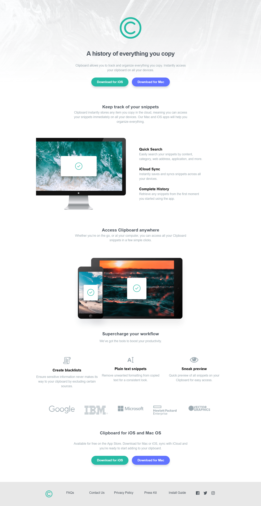

# Frontend Mentor - Clipboard landing page solution

This is a solution to the [Clipboard landing page challenge on Frontend Mentor](https://www.frontendmentor.io/challenges/clipboard-landing-page-5cc9bccd6c4c91111378ecb9). Frontend Mentor challenges help you improve your coding skills by building realistic projects.

## Table of contents

- [Frontend Mentor - Clipboard landing page solution](#frontend-mentor---clipboard-landing-page-solution)
  - [Table of contents](#table-of-contents)
  - [Overview](#overview)
    - [The challenge](#the-challenge)
    - [Screenshot](#screenshot)
    - [Links](#links)
  - [My process](#my-process)
    - [Built with](#built-with)
    - [What I learned](#what-i-learned)
    - [Useful resources](#useful-resources)
  - [Author](#author)
  - [Acknowledgments](#acknowledgments)

## Overview

### The challenge

Users should be able to:

- View the optimal layout for the site depending on their device's screen size
- See hover states for all interactive elements on the page

### Screenshot



### Links

- Solution URL: [solution URL](https://github.com/SoloLere/clipboard.git)
- Live Site URL: [live site URL](https://sololere.github.io/clipboard/)

## My process

### Built with

- Semantic HTML5 markup
- CSS custom properties
- SASS/SCSS
- Flexbox
- CSS Grid
- Mobile-first workflow - For styles

### What I learned

- Ensure even spliting of contents to be wraped i.e in 3 column layouts, it prevents 2 column across one underneath. Used it in my superchargers section

```SCSS
.content{
  flex-basis: calc(calc(40rem - 100%) * 999);
  }
```

- flex vs grid. I went for flex because it enabled me position wrapped items in second row to the center.
- I used the grid version in my footer

```scss
// FLEX
.brands {
  margin-top: 10rem;
  display: flex;
  flex-wrap: wrap;
  align-items: center;
  justify-content: center;
  gap: 5rem;
}

.brands > * {
  height: 4rem;
  flex-basis: 13rem;
  max-width: 15rem;
  // flex-basis: calc(calc(40rem - 100%) * 999); // prevents 2 across one underneath
  flex-grow: 1;
}

// GRID
.brands {
  margin-top: 10rem;
  display: grid;
  grid-template-columns: repeat(auto-fit, minmax(17rem, 1fr));
  grid-gap: 3rem;
}
```

- I finally was able to position my Destop pc image using the following

```scss
&__desktop {
  overflow: hidden;

  & > img {
    max-height: 40rem;
    margin-inline: auto;
  }

  @media screen and (min-width: $bp-large) {
    & > img {
      width: 105%;
      max-height: none;
      transform: translateX(-5%);
    }
  }
}
```

### Useful resources

- [Kevins grid solution](https://youtu.be/rg7Fvvl3taU) - This helped me for to understand the options available for my grid layout.

## Author

- Mail - [Oseni Solomon](jnrolalere@gmail.com)
- Frontend Mentor - [@myusername](https://www.frontendmentor.io/profile/@SoloLere)

## Acknowledgments

I tip my hat for Kevin Powell whose free flex course really helped me take my flex to the next level.
